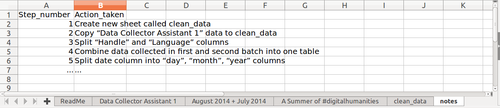
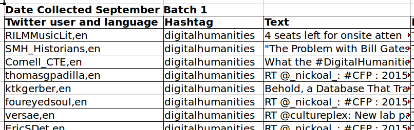
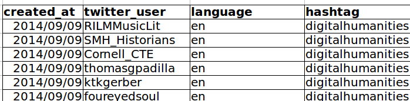

Authors: **Juan Steyn**, **Anelda van der Walt** 

Original Data Carpentry Lesson: [Ecology - Data Organisation in Spreadsheets](http://www.datacarpentry.org/spreadsheet-ecology-lesson/)
Original Data Carpentry Lesson Authors:**Christie Bahlai**, **Aleksandra Pawlik** 
Original Data Carpentry Lesson Contributors: **Jennifer Bryan**, **Alexander Duryee**, **Jeffrey Hollister**, **Daisie Huang**, **Owen Jones**, **Ben Marwick** and **Sebastian Kupny**.

## Learning Objectives
* Describe best practices for data entry and formatting in spreadsheets.
* Apply best practices to arrange variables and observations in a spreadsheet.

The most common mistake made is treating the program like it is a lab
notebook - that is, relying on **context**, notes in the margin,
spatial layout of data and fields to convey information. As humans, we
can (usually) interpret these things, but computers are dumb, and
unless we explain to the computer what every single thing means (and
that can be hard!), it will not be able to see how our data fit
together.

Using the power of computers, we can manage and analyze data in much more 
effective and faster ways, but to use that power, we have to set up
our data for the computer to be able to understand it (and computers are very 
literal).

This is why it’s extremely important to set up **well-formatted
tables** from the outset - before you even start entering data from
your very first preliminary experiment. **Data organization is the
foundation of your research project.** It can make it easier or harder
to work with your data throughout your analysis, so it's worth
thinking about when you're doing your data entry or setting up your
experiment. You can set things up in a different way in spreadsheets,
but it limits your ability to work with the data in other programs or
have the you-of-6-months-from-now or your collaborator work with the
data.

> **Note:** the best layouts/formats (as well as software and
> interfaces) for **data entry** and **data analysis** might be
> different. It is important to take this into account, and ideally
> automate the conversion from one to another.

### Keeping track of your analyses

When you're working with spreadsheets, during data clean up or analyses, it's
very easy to end up with a spreadsheet that looks very different from the one
you started with. In order to be able to reproduce your analyses or figure out
what you did when Reviewer #3 asks for a different analysis, **you must**

- **create a new file or tab with your cleaned or analyzed data.** Do not modify
that original dataset, or you will never know where you started!
- **keep track of the steps you took in your clean up or analysis.** You should track 
these steps as you would any step in an experiment. You can
do this in another text file, or a good option is to create a new tab in your spreadsheet
with your notes. This way the notes and data stay together.

This might be an example of a spreadsheet setup:

Put these principles in to practice today during your Exercises. 

### Structuring data in spreadsheets

The cardinal rules of using spreadsheet programs for data:

1. Put all your **variables in columns** - the thing you're measuring,
   like 'weight' or 'temperature'.
2. Put each **observation in its own row**.
3. **Don't combine multiple pieces of information in one
   cell**. Sometimes it just seems like one thing, but think if that's
   the only way you'll want to be able to use or sort that data.
4. **Leave the raw data raw** - don't mess with it!
5. Export the cleaned data to a **text based format** like CSV. This
   ensures that anyone can use the data, and is the format required by
   most data repositories.

For instance, we are working with Twitter data that was downloaded over a period of three and a half months. Each Tweet containing the hashtag #digitalhumanities during the period 1 June 2014 - 15 September 2014 were captured in a spreadsheet. The original dataset is available from [Figshare](https://figshare.com/articles/A_Summer_of_digitalhumanities_A_Twitter_Archive/1176099) and was created by [Ernesto Priego](https://orcid.org/0000-0003-4418-369X) through the use of software that downloaded the Tweets through the Twitter API. The spreadsheet contains information about the handle of the Tweeter, the Tweet text, time and date of Tweet, language, platform from which the Tweet was sent, and more. Because the original dataset was generated by software, it is already in a relatively clean, machine readible format.

To illustrate some of the common formatting and other mistakes that can be made when researchers are collecting data in spreadsheets, we have created a messy version of the original dataset. Our story is that we had 2 student assistants who collected the data at separate times and in slightly different formats in their spreadsheets. Below is an example of one of their spreadsheets:

The problem here is that the handle field also includes the language of the Tweet. So, if we wanted to 
look at the number of languages that were represented in Tweets with the #digitalhumanities hashtag in our dataset, 
it would be hard to extract that information from the spreadsheet in the way that it is currently set up. If instead we created separate columns for the handle and the language of the Tweet, you can see that it would be much easier. 

###Columns for variables and rows for observations

The rule of thumb, when setting up a datasheet, is **columns =
variables**, **rows = observations**, **cells = data** (values).

So, instead we should have:

## Exercise

We've made a copy of our messy version of the Twitter data available for the purpose of this lesson.

- Download the data by clicking [here](data/digital_humanities/ASummerofdigitalhumanitiesATwitterArchive_messy.xlsx) to get it from our lesson repository.

- Open up the data in a spreadsheet program 

- You can see that there are five tabs. 
 - The first tab is a "ReadMe" which you will learn about at the end of the [next episode](02-common-mistakes.md). It describes the data in this document.
 - The second and third tabs were individually collected by our two imaginary student assistants. They both collected the data in their own way. 
 - The fourth tab has been created for you to create a copy of the cleaned up data.
 - The fifth tab is where you can keep notes of what you did to clean the data up.
 
 Now you're the person in charge of this project and you want to be able to start doing
statistics with the data. 

- With the person next to you, work on the messy data so that a computer will
be able to understand it. Clean up the two tabs where data about Tweets were captured, and put them all together
in one spreadsheet. 

> **Important** Do not forget of our first piece of advice, the
> **create a new file (or tab)** for the cleaned data, **never
> modify the original (raw) data**.

After you go through this exercise, we'll discuss as a group what you think was wrong
with this data and how you fixed it. 

An excellent reference, in particular with regard to R scripting is

> Hadley Wickham, *Tidy Data*, Vol. 59, Issue 10, Sep 2014, Journal of
> Statistical Software. [http://www.jstatsoft.org/v59/i10](http://www.jstatsoft.org/v59/i10).

<!-- *Instructors see notes in 'instructors_notes.md' on this exercise.* -->

Previous: [Introduction](00-intro.html)
Next: [Formatting problems](02-common-mistakes.html)
