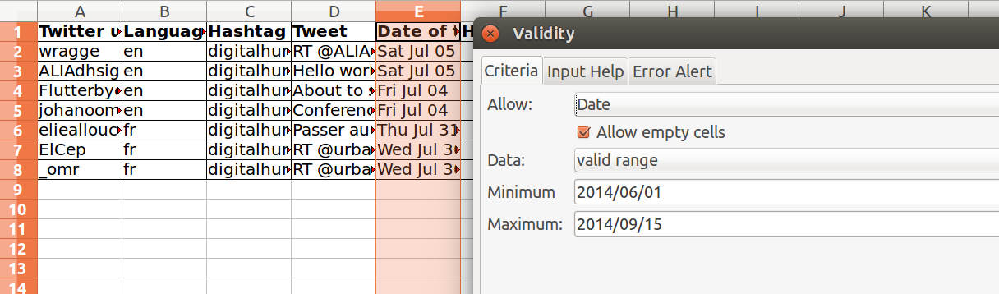
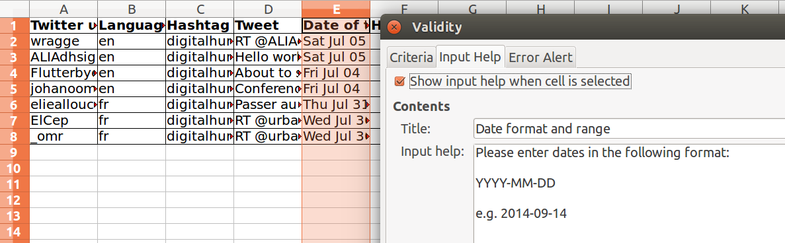
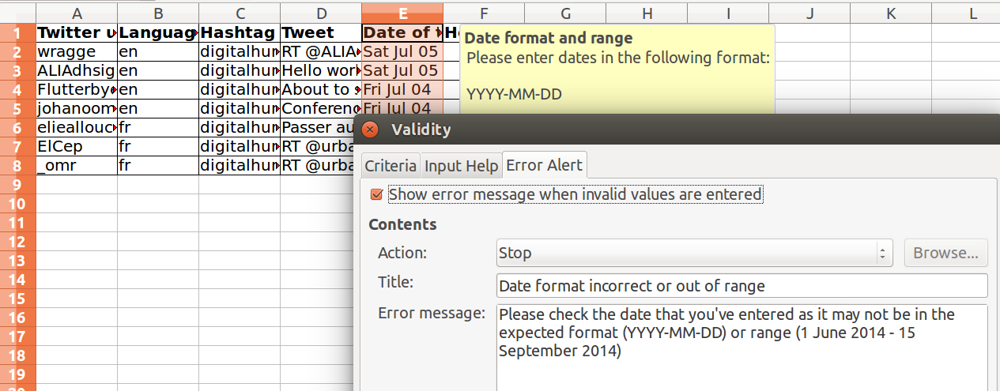
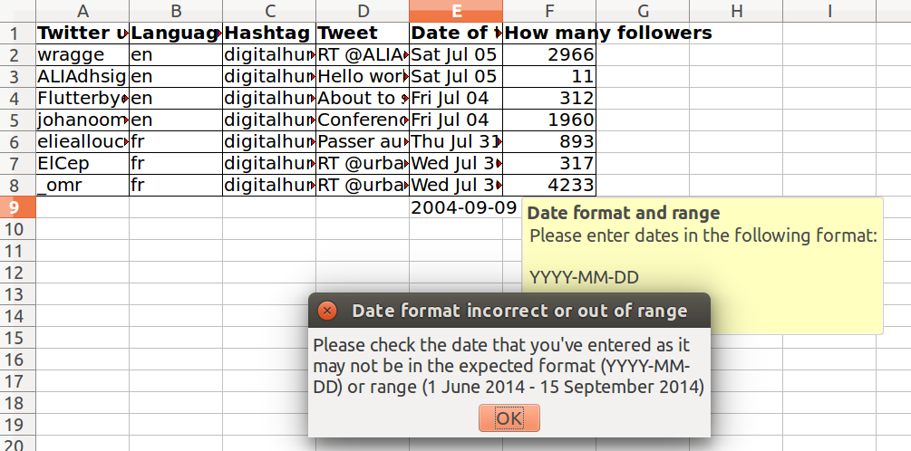
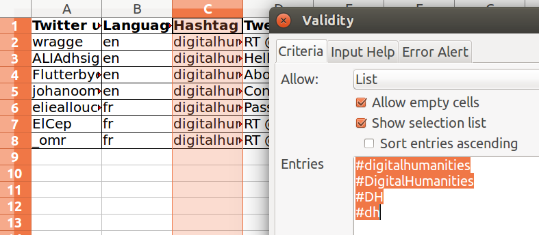
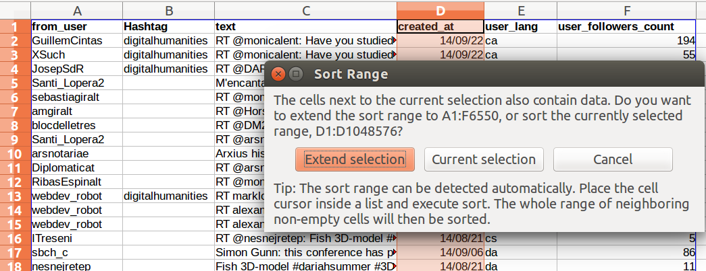
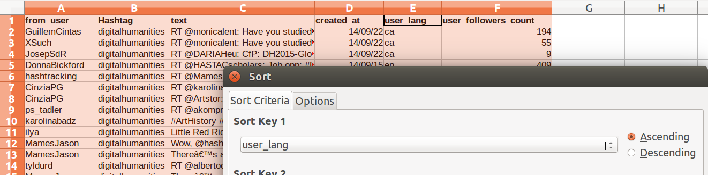
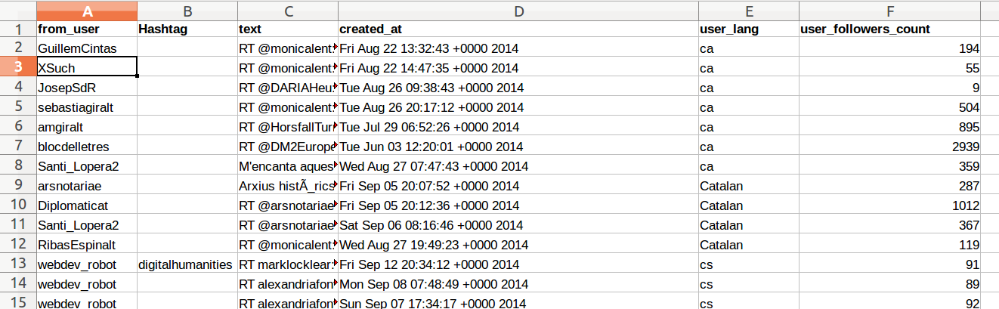
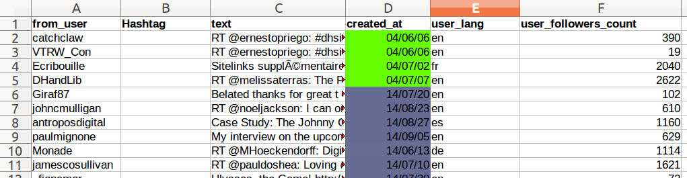

we-Deliver Modifications: **Anelda van der Walt**, **Juan Steyn**  
Original Authors:**Christie Bahlai**, **Aleksandra Pawlik** 

When you have a well-structured data table, you can use several simple
techniques within your spreadsheet to ensure the data you enter is
free of errors. These approaches include techniques that are
implemented prior to entering data (quality assurance) and
techniques that are used after entering data to check for errors
(quality control).

# Quality Assurance

Quality assurance stops bad data from ever being entered by checking to see if
values are valid during data entry. For example, if research is being conducted
at sites A, B, and C, then the value V (which is right next to B on the
keyboard) should never be entered. Likewise if one of the kinds of data being
collected is a count, only integers greater than or equal to zero should be
allowed.

To control the kind of data entered into a a spreadsheet we use Data Validation
(Excel) or Validity (Libre Office Calc), to set the values that can be entered
in each data column.

1\. Select the cells or column you want to validate

2\. On the `Data` tab select `Data Validation`

3\. In the `Allow` box select the kind of data that should be in the
   column. Options include whole numbers, decimals, lists of items, dates, and
   other values.

   
4\. After selecting an item enter any additional details. For example, if you've
   chosen a list of values, enter a comma-delimited list of allowable
   values in the `Source` box.

Let's try this out by setting the `Date of Creation` column in our spreadsheet to only allow
date values that are between 1 June 2014 and 15 September 2014.

1. Select the `Date of Creation` column
2. On the `Data` tab select `Data Validation`
3. In the `Allow` box select `Date`
4. Set the minimum and maximum values to 2014-06-01 and 2014-09-15.

Now let's try entering a new value in the plot column that isn't a valid
plot. The spreadsheet stops us from entering the wrong value and asks us if we
would like to try again.

You can also customize the resulting message to be more informative by entering
your own message in the `Input Message` tab

or allow invalid data to result in a warning rather than an error by modifying the `Style`
option on the `Error Alert` tab.

Quality assurance can make data entry easier as well as more robust. For
example, if you use a list of options to restrict data entry, the spreadsheet
will provide you with a drop-downlist of the available items. So, instead of
trying to type out, for example, the hashtag found in each Tweet, you can select the
right option from the list.

# Quality Control

Tip: *Before doing any quality control operations, save your original file with the formulas and a name indicating it is the original
data. Create a separate file with appropriate naming and versioning, and ensure your data is stored as values and not as formulas. 
Because formulas refer to other cells, and you may be moving cells around, you may compromise the integrity of your data if you do not
take this step!*

readMe (README) files: As you start manipulating your data files, create a readMe document / text file to keep track of your files and
document your manipulations so that they may be easily understood and replicated, either by your future self or by an independent
researcher. Your readMe file should document all of the files in your data set (including documentation), describe their content and
format, and lay out the organizing principles of folders and subfolders. For each of the separate files listed, it is a good idea to
document the manipulations or analyses that were carried out on those data. 
[Cornell University's Research Data Management Service Group](https://data.research.cornell.edu/content/readme) provides detailed
guidelines for how to write a good readMe file, along with an adaptable template.

## Sorting
Bad values often sort to the bottom or top of the column. For example, if your data should be numeric, then alphabetical and null data
will group at the ends of the sorted data. Sort your data by each field, one at a time. Scan through each column, but pay the most
attention to the top and the bottom of a column. 
If your dataset is well-structured and does not contain formulas, sorting should never affect the integrity of your dataset.

**Remember** to expand your sort in order to prevent data corruption. Expanding your sort ensures that the all the data in one row move together instead of only sorting a single column in isolation. Sorting by only a single column will scramble your data - a single row will no longer represent an individual observation.

> ## Exercise   
>
> We've combined all of the tables from the messy data into a single table in a single tab. Download this semi-cleaned data file to your computer: [survey_sorting_exercise](../data/digital-humanities/Twitter_sorting_cleaning.xlsx)
>
> Once downloaded, sort the `user_lang` column in your spreadsheet program in `Ascending` order. 
>
> What do you notice?
>
> > ## Solution
> > 
> > Click the Sort button on the data tab in Excel. A pop-up will appear. Make sure you select `Expand the selection`.
> >
> > 
> > {: .output}
> >
> > The following window will display, choose the column you want to sort as well as the sort order.
> >
> > 
> > {: .output}
> > 
> > 
> > **Note** how the odd values sort to the top and bottom of the tabular data. 
> > The cells containing no data values will sort to the bottom of the tabular data. If you were sorting a column that theoretically should contain only numerical data, but in reality includes text such as 79g to indicate 79 grams, these cells will sort to the top. In our case you can see that some of the user languages that were captured shows the full language in stead of the [two-letter ISO code](http://www.science.co.il/language/Codes.php). This is a powerful way to check your data for outliers and odd values.
> > 
> > 
> > {: .output}

> > 
> {: .solution}
{: .challenge}

## Conditional formatting ##
Conditional formatting basically can do something like color code your values by some
criteria or lowest to highest. This makes it easy to scan your data for outliers.

Conditional formatting should be used with caution, but it can be a great way to flag inconsistent values when entering data.

> ## Exercise
> 1. In the main Excel menu bar, click `Format` > `Conditional Formating...` Click the `+` to add a formatting rule.
> 2. We're going to try this again with the column `created_at`. 
> 3. Apply the *2-Color Scale* to `created_at`. N
> 4. Now we can scan through and different colors will stand out. You can also use this in combination with `sort` to see if anything stands out now that the human eye might have
missed before. Again, do we notice any strange values?

> 
> > ## Solution
> > 
> > Dates that are different from 2014 will colour differently. There was a data entry problem which our eye might have previously missed.
> >
> > 
> > {: .output}
> > 
> {: .solution}
{: .challenge} 

It is nice to do be able to do these scans in spreadsheets, but we also can do these
checks in a programming language like R, or in OpenRefine or SQL. 
